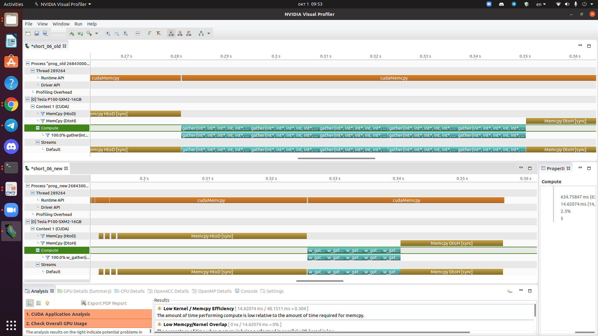

# Отчёт по 6 заданию

В новой версии программы, на обработку вершин выделяется в 32 нити больше (целый варп по сути). За счёт этого выравнивается доступ к памяти внутри ядра в цикле.

В профилировщике видно, что в новой версии в несколько раз увеличивается эффективность вычислительного ядра, которое мы улучшали. Также более равномерно загружаются SM-юниты.

В итоге, ускорение составило: 10.9/9 (ms) ~ 20%.
